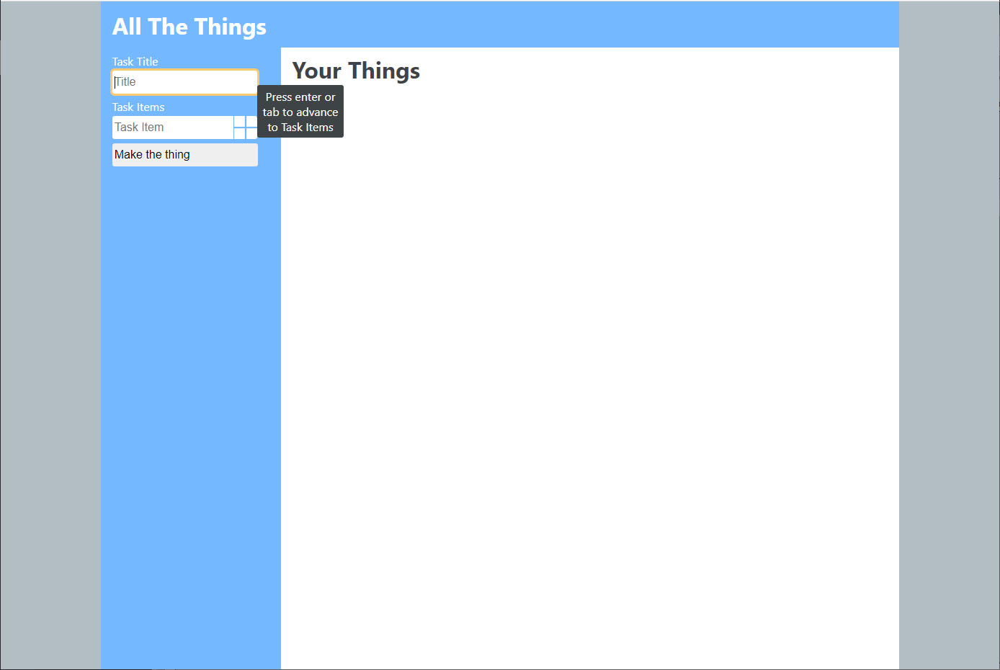
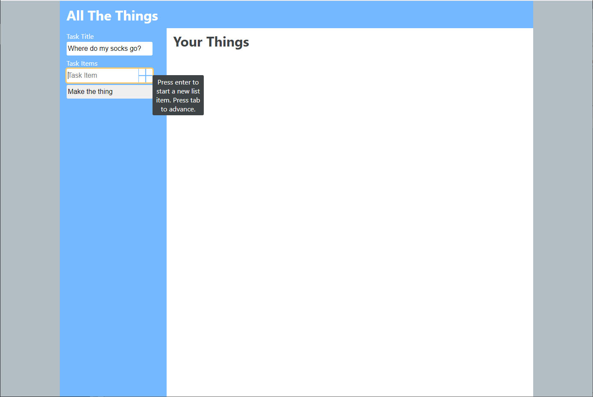
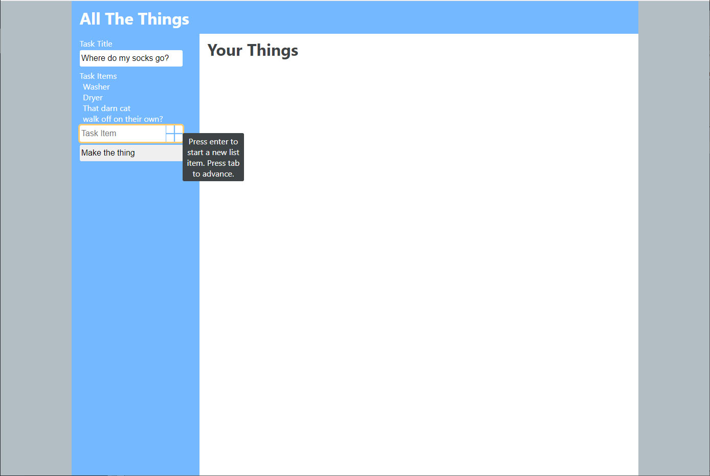
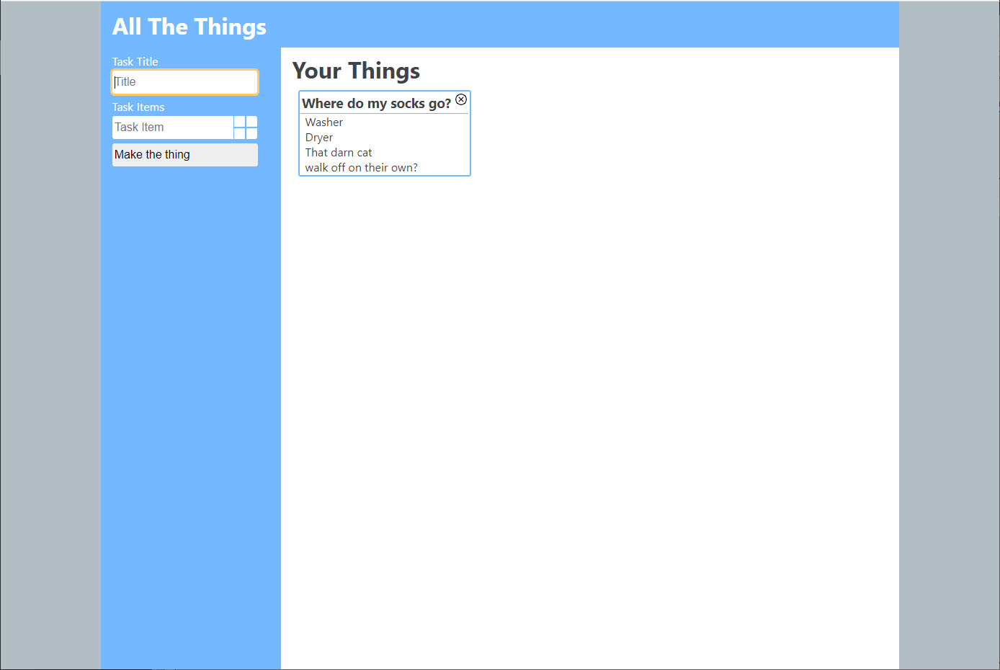
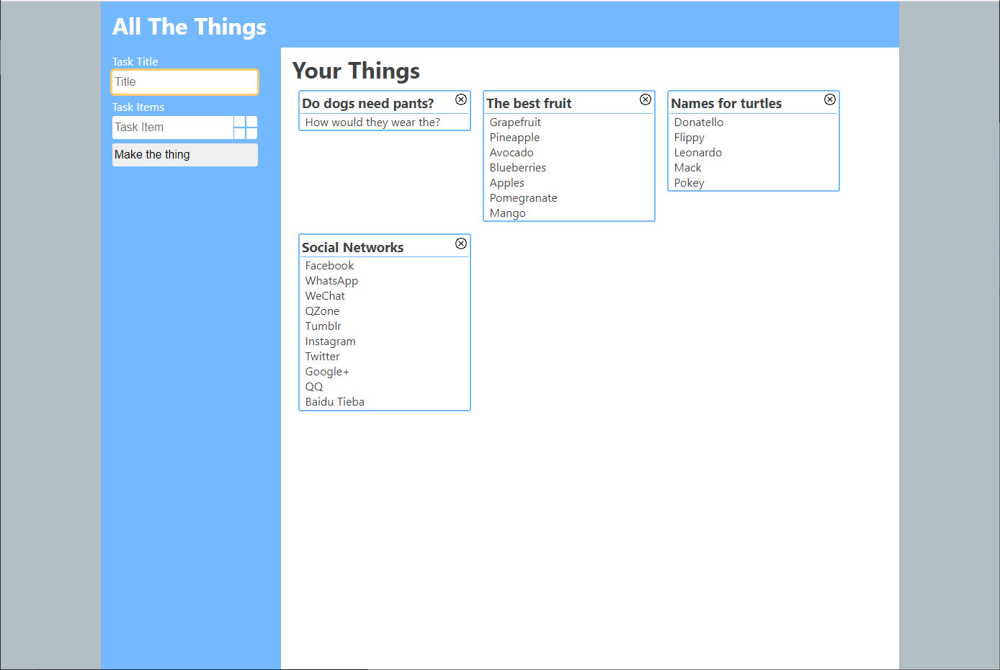
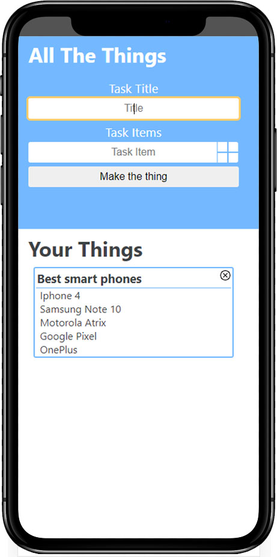

## All-The-Things

## [Live Site](https://kveitch.github.io/all-the-things/)  

## [Landing Page](https://kveitch.github.io/All-The-Things-Landing/)  

All-The-Things is a quick app built for Mintbean's September hackathon, Open Hack: No Mice.  

### The Stack
[React.js  ](https://reactjs.org/)    

## How to use the App
Go to the [live Site](https://kveitch.github.io/all-the-things/) hosted on GitHub.  The web address will contain a unique identifier for your chat room.  Copy the web address and send it to a friend.  When the URL is opened, your friend will be automatically added to your chat room.

## From the app
(Click to view)

  
Desktop views
 

  
Mobile view
 

### Future improvement

Add the ability to edit the tasks and the list.  
Add the ability to check off items in the sub-lists.  
Utilize local storage so list persist after reloading page.  
